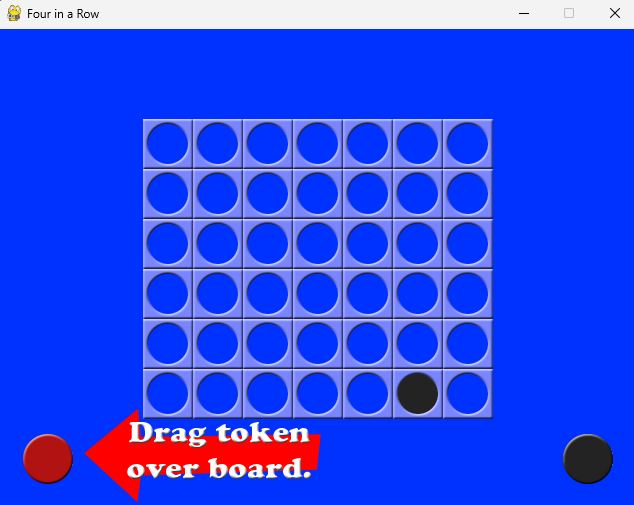
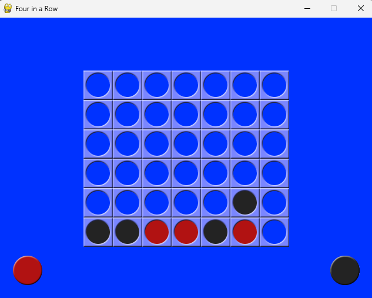
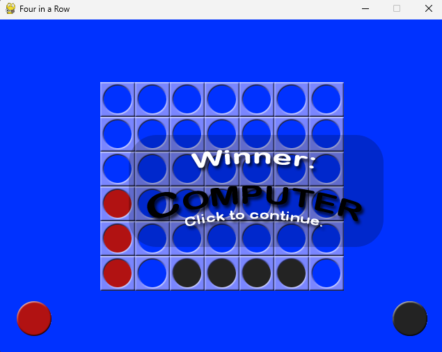

# Four in a Row (Connect Four) – Pygame

A simple **Connect Four / Four in a Row** game written in **Python using Pygame**.

The player competes against a computer AI that looks ahead several moves to choose the best move.

## 🎮 Download

[](https://github.com/ShivamKR12/four-in-a-row/releases/latest)

Download the standalone Windows executable (`four-in-a-row.exe`) from the [releases page](https://github.com/ShivamKR12/four-in-a-row/releases) – no Python installation required!

## Gameplay

* The board is **7 columns × 6 rows**.
* The **player uses red tokens**.
* The **computer uses black tokens**.
* The goal is to connect **four tokens in a row**:

  * Horizontally
  * Vertically
  * Diagonally

The first player to connect four wins. If the board fills up with no winner, the game ends in a **tie**.

## Controls

* **Drag the red token** from the left pile.
* **Drop it above the board** in the column where you want to place it.
* The computer will then make its move automatically.

Press **ESC** or close the window to quit the game.

## 📸 Screenshots

| Gameplay | AI Playing | Game Over |
|----------|-----------|-----------|
|  |  |  |

## Features

* Simple **drag-and-drop gameplay**
* Basic **AI opponent**
* Animated token dropping
* Computer move animation
* Win / loss / tie screens
* Custom board and token graphics

## Requirements

* Python 3.9+
* Pygame CE

Install dependencies:

```bash
pip install pygame-ce
```

## Running the Game

Run the game directly with Python:

```bash
python four-in-a-row.py
```

## Building a Windows Executable

The project uses **PyInstaller** to generate a standalone `.exe`.

Install PyInstaller:

```bash
pip install pyinstaller
```

Build the executable:

```bash
pyinstaller four-in-a-row.spec
```

The compiled executable will appear in:

```
dist/four-in-a-row.exe
```

This file can run on Windows **without Python installed**.

## Automated Builds (GitHub Actions)

This repository includes a GitHub Actions workflow that automatically:

1. Installs Python
2. Installs dependencies
3. Builds the executable using PyInstaller
4. Publishes the `.exe` as a **GitHub Release**

The workflow runs when:

* Code is pushed to the **master branch**
* The workflow is triggered manually

Workflow file:

```
.github/workflows/build.yml
```

## Project Structure

```
four-in-a-row/
│
├── four-in-a-row.py        # main game
├── four-in-a-row.spec      # PyInstaller build configuration
├── requirements.txt
├── README.md
│
├── 4row_arrow.png
├── 4row_black.png
├── 4row_board.png
├── 4row_computerwinner.png
├── 4row_humanwinner.png
├── 4row_red.png
├── 4row_tie.png
│
├── four-in-a-row.png       # window icon
└── four-in-a-row.ico       # executable icon
```

## AI Difficulty

The computer AI looks ahead a limited number of moves:

```python
DIFFICULTY = 2
```

Increasing this value makes the AI stronger but significantly slower.

## License

This project is provided for educational purposes. Feel free to modify and experiment with the code.

## Credits

Game implemented using:

* Python
* Pygame CE
* PyInstaller
