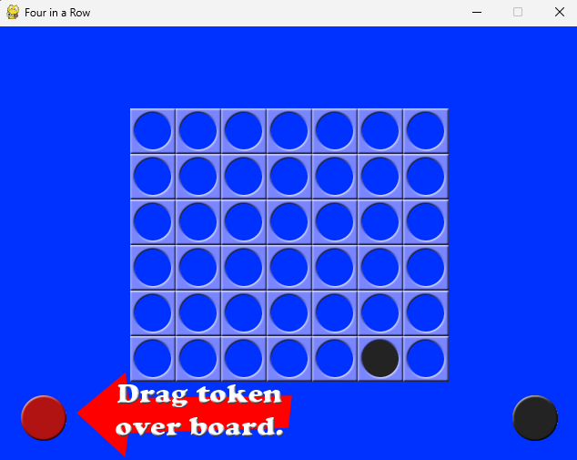

<div align="center">

# Four in a Row


[](https://github.com/ShivamKR12/four-in-a-row/actions/workflows/build.yml)


</div>

A simple Connect Four / Four in a Row game written in Python and Pygame Community Edition. The player competes against a computer AI that looks ahead several moves to choose the best move.

<div align="center">
  
</div>

## 🌐 Play Online

[](https://shivamkr12.github.io/four-in-a-row/)

Play the game directly in your web browser! Deployed automatically using [Pygbag](https://pypi.org/project/pygbag/).

## 🚀 Features

*   Simple drag-and-drop gameplay.
*   Basic AI opponent that calculates the best moves.
*   Animated token dropping and computer moves.
*   Custom board and token graphics.
*   Win / loss / tie screens.

## 🎮 Getting Started

You can easily play the game by downloading the latest version for your operating system or playing it in your browser.

1.  Go to the [**Releases**](https://github.com/ShivamKR12/four-in-a-row/releases) page.
2.  Download the appropriate file for your system (Windows, macOS, or Linux).
3.  Unzip the file and run the `four-in-a-row` executable.

**Note:** You may need to grant permissions for the application to run on macOS and Linux.

## 🕹️ How to Play

*   **Mouse Drag:** Drag the red token from the left pile.
*   **Mouse Drop:** Drop it above the board in the column where you want to place it.
*   The computer will then make its move automatically.
*   The goal is to connect **four tokens in a row** (Horizontally, Vertically, or Diagonally).
*   **Escape:** Quit the game.

## 🛠️ Building From Source

If you want to build the game yourself, you'll need Python 3 and some dependencies.

1.  **Clone the repository:**
    ```sh
    git clone https://github.com/ShivamKR12/four-in-a-row.git
    cd four-in-a-row
    ```

2.  **Create a virtual environment (recommended):**
    ```sh
    python -m venv venv
    source venv/bin/activate  # On Windows, use `venv\Scripts\activate`
    ```

3.  **Install dependencies:**
    ```sh
    pip install pygame-ce pyinstaller
    ```

4.  **Run the game:**
    ```sh
    python four-in-a-row.py
    ```

5.  **Build the executable:**
    This project uses PyInstaller to create standalone executables.
    ```sh
    pyinstaller four-in-a-row.spec
    ```
    The final executable will be in the `dist/` directory.

## 📄 License

This project is licensed under the MIT License. See the [LICENSE](LICENSE) file for details.
